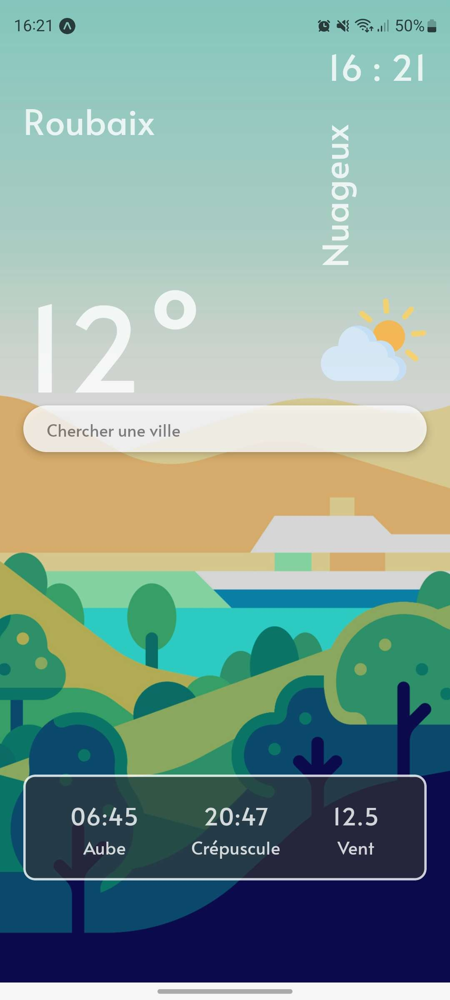
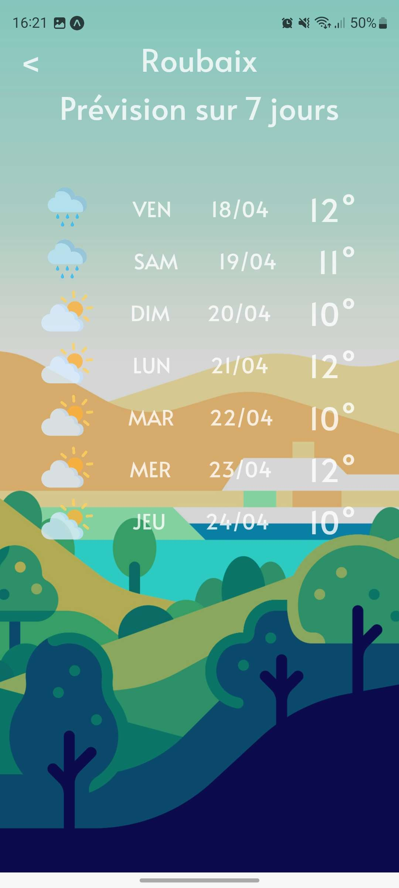
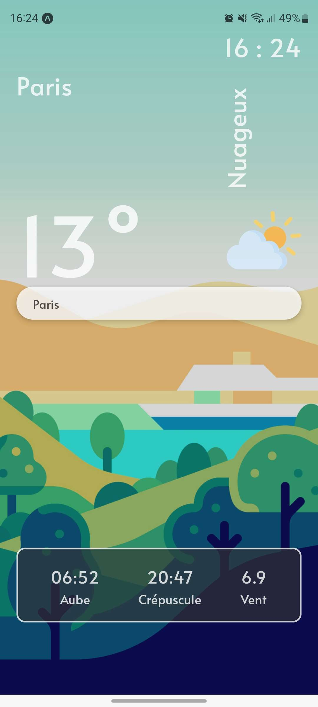

# React Native Expo Weather App

This application is a simple weather app built with React Native and Expo. It utilizes the OpenWeatherMap API to fetch current weather data for a specified city.

## Installation

1. Make sure you have Node.js installed on your machine.
2. Install Expo CLI globally by running the following command:
   ```
   npm install -g expo-cli
   ```
3. Clone this repository to your machine:
   ```
   git clone git@github.com:Pixeloceax/CDA-meteo.git
   ```
4. Navigate to the project directory:

   ```
   cd CDA-meteo
   ```

5. Install dependencies by running the following command:
   ```
   npm install
   ```

## Configuration

No configuration needed

## Usage

To run the app, execute the following command:

```
npm start
```

This will start the Expo Metro Bundler. You can then scan the generated QR code with the Expo Go app on your mobile device, or run the app in an iOS or Android emulator.

## Features

- Display current weather information for a specified city.
- Search bar for easy location search.
- Weather forecast for the next 7 days.

## Screens





